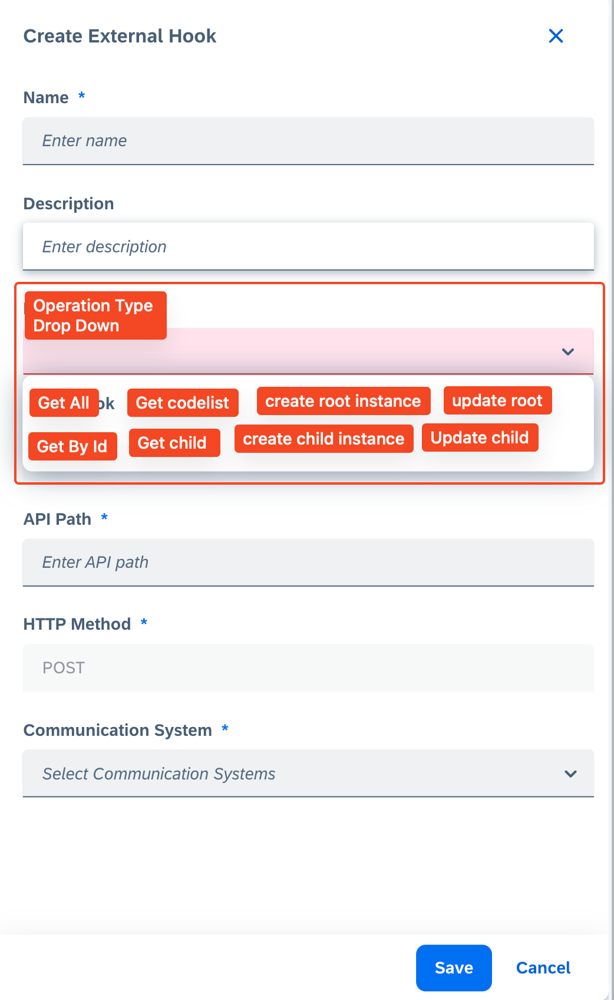

# Custom Service Approaches

## Approach 1: Separate Custom Service for Runtime Scenarios

### Pros:
- Separation of logic from design time and runtime.
- Separation of pods (helps with load balancing in runtime).
- Ease of use with respect to gRPC consumption, as it will have a separate gRPC host and port.
- Can be made as a default service.

### Cons:
- Auth scope incompatibility for existing users. This new service needs to be scope in for users.
- Introduction of a new service requires updating existing roles for end users to have access.
- Cannot add this new service as a dependent service to the extensibility service since the auth scopes are different. Extensibility is relevant for admin roles only, while this new service will apply to end users as well.

---

## Approach 2: Logical Service as Part of Extensibility

### Pros:
- Separation of pods for runtime apis.
- Access to the same database.

### Cons:
- Authorization scope: Extensibility has its own auth scope checks for admin users, which will not work for the custom service as it must be available for end users.
- Segregation of access scope at each HTTP method level.
- gRPC host remains as `extensibility-service-svc`, which may create problems with redirection in future use cases, where consumers will be calling the extensibility service.

---

## Approach 1: Go Ahead

### REST APIs

#### **Design Time (Only Admin Roles)**

1. **Store the outbound ID map**  
   **POST**: `/sap/c4c/api/v1/custom-runtime-service/outboundMap`  
```json
   {
    "entityFullName": "jobCardEntity",
    "httpMethod": "GET",
    "outboundConfigID": "bc056a28-e9e8-11ee-b63c-6915697bad7d",
    "operationType": "get-all"
  }
```
Validation cehck is required and there should not be mpre than one active api path configured for the same operation like get-all or get-by-id

3. **Delete outbound ID map**  
   **DELETE**: `/sap/c4c/api/v1/custom-runtime-service/outboundMap/{uuid}`

4. **Get outbound ID map**  
   **GET**: `/sap/c4c/api/v1/custom-runtime-service/outboundMap?$filter={any}`

#### **Runtime (Admin + End Users)**

All CRUD operations are supported via the data connector.

1. **Get a list of data**  
   **GET**: `/sap/c4c/api/v1/custom-runtime-service/entityFullName/`  
   Custom header: `x-sap-crm-custom-op: get-all`

2. **Get a single instance**  
   **GET**: `/sap/c4c/api/v1/custom-runtime-service/entityFullName/{id}`  
   Custom header: `x-sap-crm-custom-op: get-by-id`

3. **Get child instances of a root entity (array)**  
   **GET**: `/sap/c4c/api/v1/custom-runtime-service/entityFullName/{id}/childEntityFullName`  
   Custom header: `x-sap-crm-custom-op: get-child`  
   _(Note: Can have more than one childEntity.)_

4. **Get codelist data**  
   **GET**: `/sap/c4c/api/v1/custom-runtime-service/codeEntityFullName/`  
   Custom header: `x-sap-crm-custom-op: get-code-list`

5. **Create a new instance**  
   **POST**: `/sap/c4c/api/v1/custom-runtime-service/entityFullName/`  
   Body: `{json payload}`

6. **Update an instance**  
   **PATCH**: `/sap/c4c/api/v1/custom-runtime-service/entityFullName/{id}`  
   Body: `{json payload}`

7. **Delete an instance**  
   **DELETE**: `/sap/c4c/api/v1/custom-runtime-service/entityFullName/{id}`

8. **Create a new child instance**  
   **POST**: `/sap/c4c/api/v1/custom-runtime-service/entityFullName/{id}/childEntityFullName`  
   Body: `{json payload}`

9. **Update a child instance**  
   **PATCH**: `/sap/c4c/api/v1/custom-runtime-service/entityFullName/{id}/childEntityFullName/{id}`  
   Body: `{patch payload}`

10. **Delete a child instance**  
    **DELETE**: `/sap/c4c/api/v1/custom-runtime-service/entityFullName/{id}/childEntityFullName/{id}`

---

## Query Parameters

All query params are dynamic, such as:  
`$filter`, `$search`, `$top`, `$skip`, `$select`, `$count`, `$sort`, etc.

Custom headers can be replaced with custom query params.

---

## Custom Headers

Custom headers are required to differentiate between the same HTTP method calls. For example, there can be more than one flavor of the `GET` call configured as an outbound config.  
The runtime service must uniquely identify which outbound ID to propagate the call to. The server needs a mapping table that holds these IDs along with the operation performed by the user.  
Only the client will know the exact context of the user operation, e.g., whether the user wants to open a list, a specific instance, create a new instance, or edit an existing one.  
The expectation from the client is to inform the server of the user operation to resolve the API call via the connector.
Currently, custom logic is using a custom header as x-sap-crm-get-deleted for synchronisation between design time and runtime data.

---

## Finding Outbound Configurations

To find all the outbound configurations under a single custom service:  

**GET**: `/sap/c4c/api/v1/data-connector-service/outboundConfigurations?$count=true&$filter=accessScope/value eq 'CUSTOM' and serviceFullName eq {serviceFullName}`


This will list all the outbound configurations. We can ask the connector service to support a new acces scope as CUSTOM

---

## Challenges

- Users can define outbound APIs in any way that suits their use case. We may need to provide a structure or guideline for designing these APIs (similar to API definition metadata).
- There should not be any redundant outbound config with the same `apiPath`, as this will create a challenge in routing and resilience. That means, an api which serves as GET all data has to be unique and should not overalp     with any other api path.
- The dependent service concept will not work for us since the auth scopes for extensibility and custom service are different.
    - **Extensibility** is only relevant for admin roles.
    - **Custom service** is relevant for end users.
- Outbound configurations can be created only when the custom service is active and available, so it becomes a post service creation action
- Support either api metadata or data connector configuration or both? If both, then what would be the switching mechanism in the runtime? If not, what would be the design step to accomodate only api metadata or only connector config.
- edit scenarios

---

## Persistency

To be filled during design time (admin roles only) and consumed at runtime (both admin and end-user access).


In the runtime, when the backend custom runtime service is invoked while any UI operation for our custom objects scenarios, like opening an OWL/QC/TI, we will query on our below persistency to figure out which outbound config to make the the grpc call to..


Here, the entity fullname will be received from the url, http method determies the operation kind, custom http header determines the operation type. There should not be any redundancy upon operation type field value.


```json
[
  {
    "entityFullName": "jobCardEntity",
    "httpMethod": "GET",
    "outboundConfigID": "bc056a28-e9e8-11ee-b63c-6915697bad7d",
    "operationType": "get-all"
  },
  {
    "entityFullName": "jobCardEntity",
    "httpMethod": "GET",
    "outboundConfigID": "bc056a28-e9e8-11ee-b63c-6915697bad7d",
    "operationType": "get-by-id"
  },
  {
    "entityFullName": "jobCardChildEntity1",
    "httpMethod": "GET",
    "outboundConfigID": "bc056a28-e9e8-11ee-b63c-6915697bad7d",
    "operationType": "get-child"
  },
  {
    "entityFullName": "jobCardChildEntity2",
    "httpMethod": "GET",
    "outboundConfigID": "bc056a28-e9e8-11ee-b63c-6915697bad7d",
    "operationType": "get-child"
  },
  {
    "entityFullName": "jobCardCodeListEntity",
    "httpMethod": "GET",
    "outboundConfigID": "bc056a28-e9e8-11ee-b63c-6915697bad7d",
    "operationType": "get-code"
  },
  {
    "entityFullName": "jobCardEntity",
    "httpMethod": "POST",
    "outboundConfigID": "bc056a28-e9e8-11ee-b63c-6915697bad7d",
    "operationType": ""
  },
  {
    "entityFullName": "jobCardEntity",
    "httpMethod": "PATCH",
    "outboundConfigID": "bc056a28-e9e8-11ee-b63c-6915697bad7d",
    "operationType": ""
  },
  {
    "entityFullName": "jobCardEntity",
    "httpMethod": "DELETE",
    "outboundConfigID": "bc056a28-e9e8-11ee-b63c-6915697bad7d",
    "operationType": ""
  },
  {
    "entityFullName": "jobCardChildEntity",
    "httpMethod": "POST",
    "outboundConfigID": "bc056a28-e9e8-11ee-b63c-6915697bad7d",
    "operationType": ""
  },
  {
    "entityFullName": "jobCardChildEntity",
    "httpMethod": "DELETE",
    "outboundConfigID": "bc056a28-e9e8-11ee-b63c-6915697bad7d",
    "operationType": ""
  },
  {
    "entityFullName": "jobCardChildEntity",
    "httpMethod": "PATCH",
    "outboundConfigID": "bc056a28-e9e8-11ee-b63c-6915697bad7d",
    "operationType": ""
  }
]
```
---
## UI 
A dropdown list to detrmine the operation type has to be introduced in the create screen for outbound configuration. The possible values are shown as below. This is simialr to the event type in custom logic external hooks.

On successful save, the outbound config id has to be sent to our custom service along with the entity name and operations type. 

_(Note: The communciation system needs to be kept at the service definition level as its one communciation system per custom service. Also, event bridge configuration as well, needs to make use of this communciation system. The QC need not have the option to choose the communciation systems)_



## Questions

- Name of the custom service?
- Application component, e.g., CEC-CRM-CZM-EXT?
- Should it be a default service?
- Auth scope?
- Tenant scope?
